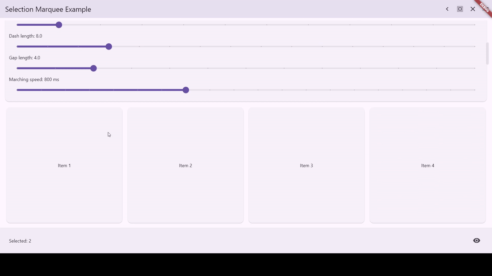
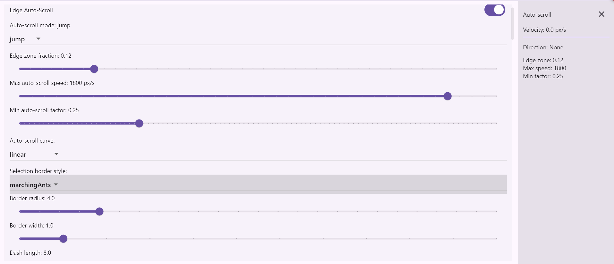

[](https://pub.dev/packages/selection_marquee)

# Selection Marquee

A highly customizable Flutter package that provides a drag-to-select marquee (selection rectangle) with support for auto-scrolling, custom styling (solid, dashed, dotted, marching ants), and easy integration with any scrollable or grid view.

## Live Demo

Check out the live example app here: [https://ricsrdocasro.github.io/selection_marquee/](https://ricsrdocasro.github.io/selection_marquee/)



## Features

- **Drag-to-Select**: Intuitive mouse and touch support (click & drag or long-press & drag).
- **Desktop-Class Interaction**:
  - **Modifiers**: `Ctrl`/`Cmd` + Drag to invert selection, `Shift` + Drag to add.
  - **Clicking**: Simple click to select, `Ctrl`+Click to toggle, `Shift`+Click for range selection.
  - **Keyboard Shortcuts**: `Ctrl+A` (Select All) and `Esc` (Clear Selection).
  - **Right-Click**: Smart context menu handling (selects unselected items before showing menu).
  - **Scroll Management**: `dragScrollBehavior` manages "gesture fighting" by controlling default drag-scrolling.
    - **auto**: (Default) Disables drag-scroll on Desktop (allowing marquee) and enables it on Mobile.
    - **disabled**: Always disables drag-scroll.
    - **enabled**: Always enables drag-scroll (standard Flutter).
- **Auto-Scroll**: Automatically scrolls the view when dragging near the edges.
  - Supports both `jump` and `animate` modes.
  - Customizable speed, edge zone size, and acceleration curves.
- **Custom Styling**: Fully customizable selection border and fill.
  - Styles: `solid`, `dashed`, `dotted`, `marchingAnts`.
  - Adjustable border width, dash length, gap length, and border radius.
  - "Marching Ants" animation support with configurable speed.
- **Controller-Based**: `SelectionController` manages selection state and provides a stream of updates.
- **Flexible Integration**: Works with any widget layout (ListView, GridView, CustomScrollView, etc.).
- **Item Visibility**: Helper methods to programmatically scroll to selected items.



## Installation

Add `selection_marquee` to your `pubspec.yaml`:

```yaml
dependencies:
  selection_marquee: ^0.1.0
```

Or run:

```bash
flutter pub add selection_marquee
```

## Usage

### 1. Initialize Controller and Keys

Create a `SelectionController` and a `GlobalKey` for the marquee widget.

```dart
final SelectionController _controller = SelectionController();
final GlobalKey _marqueeKey = GlobalKey();
```

### 2. Wrap your ScrollView

Wrap your scrollable content (e.g., `GridView`, `ListView`) with the `SelectionMarquee` widget. Pass the controller, key, and the scroll controller of your list.

```dart
SelectionMarquee(
  controller: _controller,
  marqueeKey: _marqueeKey,
  scrollController: _scrollController, // Important for auto-scroll!
  enableShortcuts: true, // Enable Ctrl+A / Esc
  dragScrollBehavior: DragScrollBehavior.auto, // Desktop: disabled, Mobile: enabled
  child: GridView.builder(
    controller: _scrollController,
    // ...
  ),
)
```

### 3. Make Items Selectable

Wrap each item in your list with `SelectableItem`. This widget registers itself with the controller and handles hit testing and interactions.

```dart
SelectableItem(
  id: 'item_1', // Unique ID for the item
  controller: _controller,
  marqueeKey: _marqueeKey,
  onContextMenu: (position) {
    // Handle right-click context menu
    // The item is automatically selected if it wasn't already.
    showMenu(context: context, position: position, items: [...]);
  },
  selectedBuilder: (context, child, isSelected) {
    return Container(
      color: isSelected ? Colors.blue.withOpacity(0.5) : Colors.white,
      child: Text('Item 1'),
    );
  },
  child: MyItemWidget(),
)
```

### 4. Support "Select All" in Virtual Lists

If you are using a virtualized list (like `ListView.builder` with many items), you must provide the `allItemsGetter` to the controller so `Ctrl+A` knows about items that aren't currently rendered.

```dart
@override
void initState() {
  super.initState();
  _controller.allItemsGetter = () => myCompleteListOfIds;
}
```

### 5. Listen for Changes

You can listen to selection changes via the controller:

```dart
ValueListenableBuilder<Set<String>>(
  valueListenable: _controller.selectedListenable,
  builder: (context, selectedIds, _) {
    return Text('${selectedIds.length} items selected');
  },
)
```

## Configuration

### Customizing the Selection Box

You can customize the appearance of the selection box using `SelectionConfig` and `SelectionDecoration`.

```dart
SelectionMarquee(
  // ...
  config: SelectionConfig(
    selectionDecoration: SelectionDecoration(
      borderStyle: SelectionBorderStyle.marchingAnts, // or solid, dashed, dotted
      borderWidth: 2.0,
      fillColor: Colors.blue.withOpacity(0.1),
      borderColor: Colors.blue,
      dashLength: 8.0,
      gapLength: 4.0,
      marchingSpeed: Duration(milliseconds: 500),
    ),
  ),
)
```

### Configuring Auto-Scroll

Auto-scroll behavior can be fine-tuned via `SelectionConfig`.

```dart
SelectionConfig(
  edgeAutoScroll: true,
  autoScrollSpeed: 600.0, // Pixels per second
  edgeZoneFraction: 0.15, // Top/bottom 15% of the view triggers scroll
  autoScrollMode: AutoScrollMode.animate, // or jump
  autoScrollCurve: Curves.easeOut,
)
```

## API Overview

### SelectionController

- `select(String id)`: Adds an item to the selection.
- `deselect(String id)`: Removes an item from the selection.
- `toggle(String id)`: Toggles selection state.
- `clear()`: Clears all selected items.
- `selectAll({Iterable<String>? candidates})`: Selects all provided candidates.
- `ensureItemVisible(String id)`: Scrolls to make the specified item visible.
- `selectedIds`: The current set of selected IDs.
- `onSelectionChanged`: Stream of selection updates.

### SelectableItem

- `id`: Unique identifier for the item.
- `registerOnBuild`: Whether to automatically register the item's geometry (default: `true`).
- `selectedBuilder`: Optional builder to customize the child's appearance based on selection state.

## Contributing

Contributions are welcome! If you find a bug or want to add a feature, please open an issue or submit a pull request.

## License

This project is licensed under the MIT License - see the [LICENSE](LICENSE) file for details.